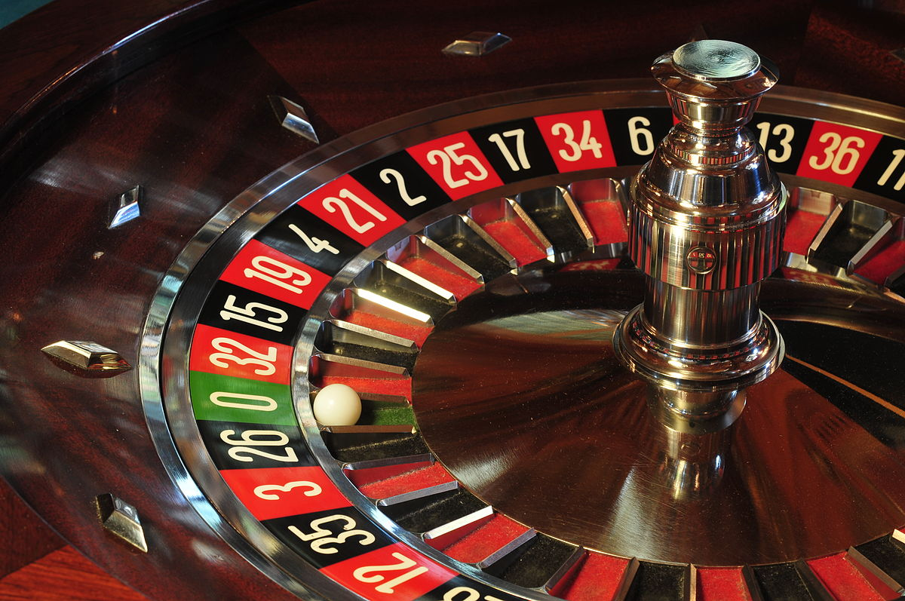

# Roulette-Simulation
Modelagem e Simulação de um jogo de roleta

No Las Vegas Casino, nos Estados Unidos, as roletas têm 18 slots de cor vermelha, 18
slots de cor preta e 1 slots de cor verde (numerado de 0). Os slots vermelho e preto são
numerados de 1 a 36. Para as faixas de números de 1 a 10 e de 19 a 28, os números
ímpares são vermelhos e pares são pretos. Para as faixas de 11 a 18 e de 29 a 36, os
números ímpares são pretos e pares são vermelhos. Na roleta, você pode jogar vários
“jogos” ou “sistemas”, entre eles pode-se citar:

## Apostar no Vermelho
* Este jogo envolve apenas uma aposta. Você aposta $1 no
vermelho. Se a bola cair no vermelho, você ganha $1, caso contrário, você perde.

## Apostar em um número
* Este jogo envolve apenas uma aposta. Você aposta $1 em
um número específico, digamos 15; se a bola cair nesse número, você ganha $35,
caso contrário, você perde.

## Sistema Martingale
* Neste jogo, você começa apostando $1 no vermelho. Se você
perder, você dobra sua aposta anterior; se você ganhar, ganhará o apostado e voltará
a apostar $1 novamente na próxima rodada. Você continua jogando até ganhar $10
(no acumulado) ou a aposta exceder os $100.

## Sistema Labouchere
* Neste jogo você começa com a lista de números (1, 2, 3, 4).
Você aposta no vermelho e o valor da aposta é a soma do primeiro e do último número
(inicialmente $5). Se você vencer, ganhará o valor da aposta e excluirá o primeiro e o
último número da lista (por isso, se você ganhar em sua primeira aposta, a lista ficará
(2,3)); caso contrário, você adicionará o valor da aposta ao final da sua lista (por isso,
se você perder na primeira aposta, a lista ficará (1, 2, 3, 4, 5)). Você repete esse
processo até que sua lista esteja vazia ou até que a aposta exceda 100 dólares. Se
apenas um número for deixado na lista, você aposta o valor deste número.

O objetivo é comparar os quatros sistemas acima usando os seguintes critérios
* Os ganhos esperados por jogo
* A proporção de jogos que você ganha
* O tempo esperado jogo por jogo, medido pelo número de apostas feitas
* A quantidade máxima de dinheiro que você pode perder
* A quantidade máxima de dinheiro que você pode ganhar
